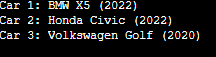

# Чащина Ксения Владимировна ИВТ-1.2

## Rust ­ Лабораторная работа №1

_ _ _

### **Задание 1.**
Напишите программу, которая запрашивает у пользователя имя и выводит на экран приветственное сообщение с использованием этого имени.
_ _ _

**Список идентификаторов:**
| Имя | Тип    | Описание                           |
|-----|--------|------------------------------------|
| name   | String   | Изменяемая переменная имени        |

**Код программы:**
```c
use std::io;

fn main() {
    println!("Enter your name:");
    let mut name = String::new();
    io::stdin()
        .read_line(&mut name) 
        .expect("Error!"); 
    let name = name.trim(); 
    println!("Hello, {}!", name); 
}
```

**Результат выполненной работы:**

_ _ _

### **Задание 2.**
Создайте переменную типа целое беззнаковое число и выведите ее значение на экран. Явно укажите тип переменной. Затем измените значение переменной и снова выведите его.
_ _ _

**Список идентификаторов:**
| Имя | Тип    | Описание                           |
|-----|--------|------------------------------------|
| number   | u32   | Изменяемая переменная для числа        |

**Код программы:**
```c
fn main() {
    let mut number: u32 = 13;
    println!("Number: {}", number);
    number = 25;
    println!("New number: {}", number);
}
```

**Результат выполненной работы:**


_ _ _

### **Задание 3.**
Напишите функцию, которая принимает строку и возвращает ее длину (количество символов). Затем вызовите эту функцию с различными строками.
_ _ _

**Список идентификаторов:**
| Имя | Тип    | Описание                           |
|-----|--------|------------------------------------|
| string_length   | fn   | Функция для принятия строки       |
| string1, string2, string3   | String   | Строки        |

**Код программы:**
```c
fn string_length(s: &str) -> usize {
    s.len()
}

fn main() {
    let string1 = "Hello World!";
    let string2 = "I love chocolate";
    let string3 = "251308";
    println!("Length '{}': {}", string1, string_length(string1));
    println!("Length '{}': {}", string2, string_length(string2));
    println!("Length '{}': {}", string3, string_length(string3));
}
```

**Результат выполненной работы:**


_ _ _

### **Задание 4.**
Задайте структуру Car с полями brand, model и year, и создайте несколько экземпляров этой структуры. Выведите информацию о каждой машине на экран.
_ _ _

**Список идентификаторов:**
| Имя | Тип    | Описание                           |
|-----|--------|------------------------------------|
| Car   | struct   | Структура        |
| brand   | String   | Поле для бренда машины        |
| model   | String   | Поле для модели машины        |
| year   | u32   | Поле для года выпуска машины        |

**Код программы:**
```c
struct Car {
    brand: String,
    model: String,
    year: u32,
}

fn main() {
    let car1 = Car {
        brand: String::from("Toyota"),
        model: String::from("Corolla"),
        year: 2020,
    };
    let car2 = Car {
        brand: String::from("Honda"),
        model: String::from("Civic"),
        year: 2022,
    };
    let car3 = Car {
        brand: String::from("Ford"),
        model: String::from("Mustang"),
        year: 1967,
    };
    println!("Car 1: {} {} ({})", car1.brand, car1.model, car1.year);
    println!("Car 2: {} {} ({})", car2.brand, car2.model, car2.year);
    println!("Car 3: {} {} ({})", car3.brand, car3.model, car3.year);
}
```

**Результат выполненной работы:**


_ _ _

### **Задание 5.**
Напишите программу, которая запрашивает у пользователя число N и выводит на экран N-­ное число Фибоначчи. Используйте рекурсию для решения этой задачи.
_ _ _

**Список идентификаторов:**
| Имя | Тип    | Описание                           |
|-----|--------|------------------------------------|
| fibonacci   | fn   | Функция для нахождения числа Фибоначчи        |
| n   | u32   | Число N        |
| result   | u32   | Результат, число Фибоначчи        |

**Код программы:**
```c
use std::io;
use std::str::FromStr;

fn fibonacci(n: u32) -> u64 {
    match n {
        0 => 0,
        1 => 1,
        _ => fibonacci(n - 1) + fibonacci(n - 2),
    }
}

fn main() {
    println!("Input N:");
    let mut input = String::new();
    io::stdin()
        .read_line(&mut input)
        .expect("Error");
    let n: u32 = match input.trim().parse() {
        Ok(num) => num,
        Err(_) => {
            println!("Error. Enter an integer");
            return; 
        }
    };
    let result = fibonacci(n);
    println!("{} Fibonacci number: {}", n, result);
}
```

**Результат выполненной работы:**


_ _ _

### **Задание 6.**
Реализуйте перечисление DayOfWeek для дней недели. Напишите функцию, которая принимает день недели и возвращает следующий день. Обработайте случаи перехода на следующий день недели, если текущий день – воскресенье.
_ _ _

**Список идентификаторов:**
| Имя | Тип    | Описание                           |
|-----|--------|------------------------------------|
| DayOfWeek   | enum   | Перечисление дней недели        |
| next_day   | fn   | Функция для вывода следующего дня недели        |

**Код программы:**
```c
#[derive(Debug, PartialEq, Copy, Clone)]
enum DayOfWeek {
    Monday, Tuesday, Wednesday, Thursday, Friday, Saturday, Sunday
}

fn next_day(day: DayOfWeek) -> DayOfWeek {
    match day {
        DayOfWeek::Monday => DayOfWeek::Tuesday,
        DayOfWeek::Tuesday => DayOfWeek::Wednesday,
        DayOfWeek::Wednesday => DayOfWeek::Thursday,
        DayOfWeek::Thursday => DayOfWeek::Friday,
        DayOfWeek::Friday => DayOfWeek::Saturday,
        DayOfWeek::Saturday => DayOfWeek::Sunday,
        DayOfWeek::Sunday => DayOfWeek::Monday, 
    }
}

fn main() {
    let today = DayOfWeek::Wednesday;
    let tomorrow = next_day(today);
    println!("Today: {:?}", today);
    println!("Tomorrow: {:?}", tomorrow);
    let today = DayOfWeek::Sunday;
    let tomorrow = next_day(today);
    println!("Today: {:?}", today);
    println!("Tomorrow: {:?}", tomorrow);
}

```

**Результат выполненной работы:**


_ _ _

### **Задание 7.**
Создайте структуру Product с полями name, price и category, а также перечисление (enum) Category для категорий товаров. Напишите метод для вывода информации о продукте и ассоциированную функцию для подсчета общей суммы товаров в заданной категории из массива продуктов.
_ _ _

**Список идентификаторов:**
| Имя | Тип    | Описание                           |
|-----|--------|------------------------------------|
| number   | u32   | Изменяемая переменная для числа        |

**Код программы:**
```c
fn main() {
    let mut number: u32 = 13;
    println!("Number: {}", number);
    number = 25;
    println!("New number: {}", number);
}
```

**Результат выполненной работы:**

