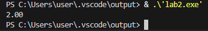
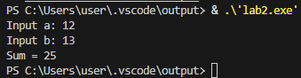
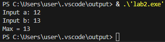
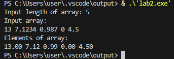
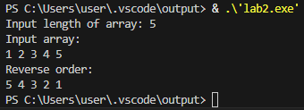
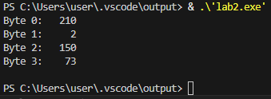
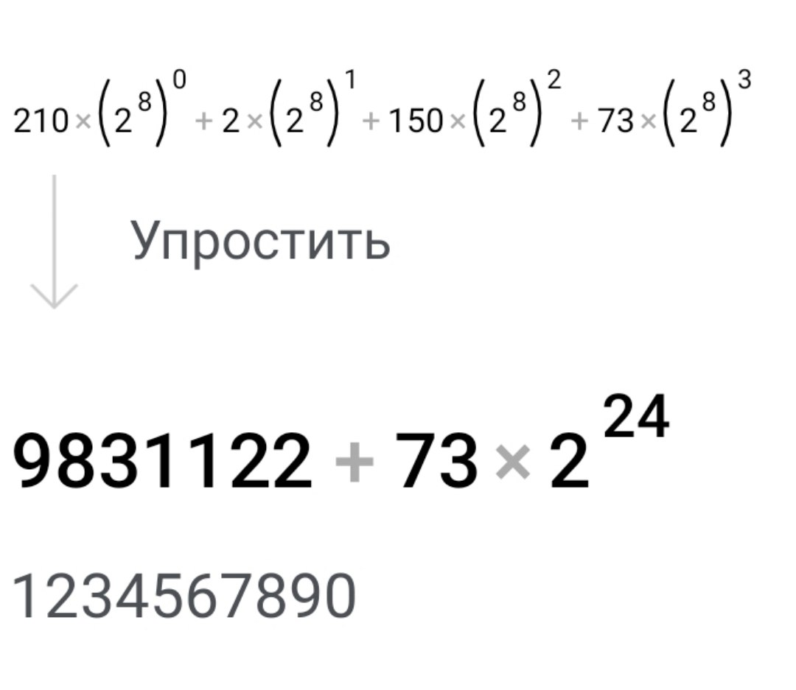
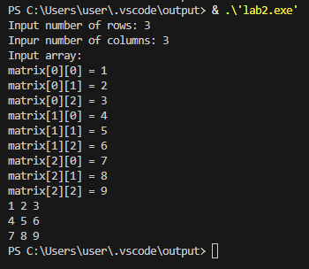

# Чащина Ксения Владимировна ИВТ-1.2

## Тема: Указатели, арифметика указателей

_ _ _

### **Задание 1.**
Внутри функции int main(void) { /*...*/ } определите указатель double ***pointer = NULL;. Инициализируйте этот указатель адресом другого указателя типа double **, который указывает на переменную double *, которая указывает на double. Используйте pointer для записи и чтения значения 2.0 в сегмент оперативной памяти для double.

_ _ _

**Список идентификаторов:**
| Имя | Тип    | Описание                           |
|-----|--------|------------------------------------|
| pointer   | double ***    | Тройной указатель        |
| -   | double **    | Указатель, на который хранит адрес double*        |
| - | double *    | Указатель, на который хранит адрес double               |
| - | double    | Переменная, в которой хранится 2.0               |

**Код программы:**
```c
#include <stdio.h>
#include <stdlib.h>

int main()
{
    double ***pointer = NULL;
    *( *( *(pointer = (double ***)malloc(sizeof(double **))) = (double **)malloc(sizeof(double *)) ) = (double *)malloc(sizeof(double)) ) = 2.0;
    if (pointer == NULL) {      
        return 1;
    }
    printf("%.2lf\n", ***p);
    
    free(**pointer);    
    free(*pointer);     
    free(pointer);      
    
    return 0;
}
```

**Результат выполненной работы:**


_ _ _

### **Задание 2.** Сложение двух чисел
Напишите программу, которая складывает два числа с использованием указателей на эти числа.

_ _ _

**Список идентификаторов:**
| Имя | Тип    | Описание                           |
|-----|--------|------------------------------------|
| a   | int    | Первое слагаемое        |
| b   | int    | Второе слагаемое        |
| ptr1 | int*    | Указатель на переменную a          |
| ptr2 | int*    | Указатель на переменную b          |

**Код программы:**
```c
#include <stdio.h>

int main() {
  int a, b;
  int *ptr1 = &a, *ptr2 = &b;
  printf("Input a: ");
  scanf("%d", ptr1);
  printf("Input b: ");
  scanf("%d", ptr2);

  printf("Sum = %d\n", *ptr1 + *ptr2);

  return 0;
}
```

**Результат выполненной работы:**


_ _ _

### **Задание 3.** Нахождение максимума из двух чисел
Напишите программу, которая находит максимальное число из двух чисел, используя указатели на эти числа.

_ _ _

**Список идентификаторов:**
| Имя | Тип    | Описание                           |
|-----|--------|------------------------------------|
| a   | int    | Первое число        |
| b   | int    | Второе число        |
| ptr1 | int*    | Указатель на переменную a          |
| ptr2 | int*    | Указатель на переменную b          |
| max | int    | Максимальное значение               |

**Код программы:**
```c
#include <stdio.h>

int main() {
  int a, b, max;
  int *ptr1 = &a, *ptr2 = &b;
  printf("Input a: ");
  scanf("%d", &a);
  printf("Input b: ");
  scanf("%d", &b);
  if (*ptr1 > *ptr2) {
    max = *ptr1;
  } else {
    max = *ptr2;
  }
  printf("Max = %d\n", max);

  return 0;
}
```

**Результат выполненной работы:**


_ _ _

### **Задание 4.** Динамический массив с плавающей точкой
Напишите программу, которая создаёт одномерный динамический массив из чисел с плавающей точкой двойной точности, заполняет его значениями с клавиатуры и распечатывает все элементы этого массива, используя
арифметику указателей (оператор +), а не оператор доступа к элементу массива [].

_ _ _

**Список идентификаторов:**
| Имя | Тип    | Описание                           |
|-----|--------|------------------------------------|
| n   | int    | Длина массива        |
| arr   | double*    | Указатель на начало массива        |
| p | double*    | Указатель для обхода массива          |
| i | int    | Параметр цикла          |

**Код программы:**
```c
#include <stdio.h>
#include <stdlib.h>

int main() {
  int n;
  double *arr;
  double *p; 

  printf("Input length of array: ");
  scanf("%d", &n);
  arr = (double *)malloc(n * sizeof(double));
  if (arr == NULL) {
    printf("Memory allocation error!\n");
    return 1;
  }
  printf("Input array:\n");
  for (p = arr; p < arr + n; p++) {
    scanf("%lf", p);
  }
  printf("Elements of array:\n");
  for (p = arr; p < arr + n; p++) {
    printf("%.2lf ", *p);
  }
  printf("\n");
  free(arr);

  return 0;
}
```

**Результат выполненной работы:**


_ _ _

### **Задание 5.** Обратный порядок элементов массива
Выведите элементы динамического массива целых чисел в обратном порядке, используя указатель и операцию
декремента (--).

_ _ _

**Список идентификаторов:**
| Имя | Тип    | Описание                           |
|-----|--------|------------------------------------|
| n   | int    | Длина массива        |
| arr   | int*    | Указатель на начало массива        |
| p | int*    | Указатель для обхода массива          |
| i | int    | Параметр цикла          |

**Код программы:**
```c
#include <stdio.h>
#include <stdlib.h>

int main() {
  int n;
  int *arr;
  int *p;
  printf("Input length of array: ");
  scanf("%d", &n);
  arr = (int *)malloc(n * sizeof(int));
  if (arr == NULL) {
    printf("Memory allocation error!\n");
    return 1;
  }
  printf("Input array:\n");
  for (int i = 0; i < n; i++) {
    scanf("%d", &arr[i]);
  }
  printf("Reverse order:\n");
  p = arr + n - 1;
  for (int i = 0; i < n; i++) {
    printf("%d ", *p);
    p--;
  }
  printf("\n");
  free(arr);

  return 0;
}
```

**Результат выполненной работы:**


_ _ _

### **Задание 6.** Побайтовый вывод переменной
Определите переменную целого типа int a = 1234567890; и выведите побайтово её содержимое на экран,
используя указатель char *.

_ _ _

**Список идентификаторов:**
| Имя | Тип    | Описание                           |
|-----|--------|------------------------------------|
| a   | int    | Заданное значение        |
| p | unsigned char*    | Указатель для доступа к байтам      |
| i | int    | Параметр цикла          |

**Код программы:**
```c
#include <stdio.h>
#include <stdint.h> 

int main() {
  int a = 1234567890;
  unsigned char *p; 
  int i;
  p = (unsigned char *)&a; 
  for (i = 0; i < sizeof(a); i++) {
    printf("Byte %d: %5d\n", i, *(p + i));
  }
  printf("\n");

  return 0;
}
```

**Результат выполненной работы:**


**Проверка результата:**


_ _ _

### **Задание 7.** Двумерный динамический массив
Выделите память под двумерный динамический массив, используя массив указателей на строки (см. лекции), и
затем корректно освободите оперативную память.

_ _ _

**Список идентификаторов:**
| Имя | Тип    | Описание                           |
|-----|--------|------------------------------------|
| rows   | int    | Количество строк        |
| cols   | int    | Количество столбцов        |
| matrix | int**    | Указатель на массив          |
| i | int    | Параметр цикла          |
| j | int    | Параметр цикла          |

**Код программы:**
```c
#include <stdio.h>
#include <stdlib.h>

int main() {
  int rows, cols;
  int **matrix; 

  printf("Input number of rows: ");
  scanf("%d", &rows);
  printf("Inpur number of columns: ");
  scanf("%d", &cols);

  matrix = (int **)malloc(rows * sizeof(int *));
  if (matrix == NULL) {
    printf("Memory allocation error!\n");
    return 1;
  }

  for (int i = 0; i < rows; i++) {
    matrix[i] = (int *)malloc(cols * sizeof(int));
    if (matrix[i] == NULL) {
      printf("Memory allocation error for row %d!\n", i);
      for (int j = 0; j < i; j++) {
        free(matrix[j]);
      }
      free(matrix);
      return 1;
    }
  }

  printf("Input array:\n");
  for (int i = 0; i < rows; i++) {
    for (int j = 0; j < cols; j++) {
      printf("matrix[%d][%d] = ", i, j);
      scanf("%d", &matrix[i][j]);
    }
  }

  for (int i = 0; i < rows; i++) {
    for (int j = 0; j < cols; j++) {
      printf("%d ", matrix[i][j]);
    }
    printf("\n");
  }

  for (int i = 0; i < rows; i++) {
    free(matrix[i]);
  }

  free(matrix);

  return 0;
}
```

**Результат выполненной работы:**



