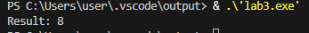
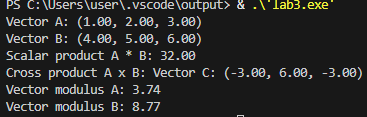
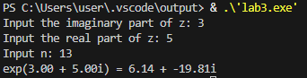
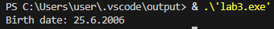
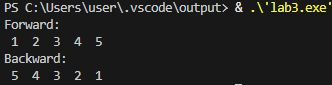
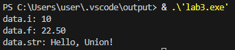
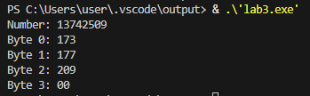
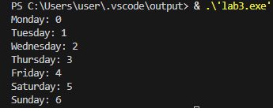

# Чащина Ксения Владимировна ИВТ-1.2

## Тема: Структуры. Объединения. Перечисления.

_ _ _

### **Задание 1.1.**
Создать некоторую структуру с указателем на некоторую функцию в качестве поля. Вызвать эту функцию через имя переменной этой структуры и поле указателя на функцию.
_ _ _

**Список идентификаторов:**
| Имя | Тип    | Описание                           |
|-----|--------|------------------------------------|
| pointer   | double ***    | Тройной указатель        |
| -   | double **    | Указатель, на который хранит адрес double*        |
| - | double *    | Указатель, на который хранит адрес double               |
| - | double    | Переменная, в которой хранится 2.0               |

**Код программы:**
```c

```

**Результат выполненной работы:**


_ _ _

### **Задание 1.2.**
Создать структуру для вектора в 3-х мерном пространстве. Реализовать и использовать в своей программе следующие операции над
векторами:
- скалярное умножение векторов;
- векторное произведение;
- модуль вектора;
- распечатка вектора в консоли.

В структуре вектора указать имя вектора в качестве отдельного поля этой структуры
_ _ _

**Математическая модель:**

Скалярное произведение:  

$$
\vec{a} \cdot \vec{b} = a_x b_x + a_y b_y + a_z b_z
$$

Векторное произведение:  

$$
\vec{a} \times \vec{b} = 
\begin{vmatrix}
\vec{i} & \vec{j} & \vec{k} \\
a_x & a_y & a_z \\
b_x & b_y & b_z
\end{vmatrix} 
= \vec{i} \cdot (a_y b_z - a_z b_y) - \vec{j} \cdot (a_x b_z - a_z b_x) + \vec{k} \cdot (a_x b_y - a_y b_x)
$$

Модуль вектора:  

$$
|v| = \sqrt{v_x^2 + v_y^2 + v_z^2}
$$

**Список идентификаторов:**
| Имя | Тип    | Описание                           |
|-----|--------|------------------------------------|
| Vec   | struct    | Структура для 3D вектора        |
| x, y, z   | double   | Координаты вектора        |
| scalarProduct | double    | Скалярное произведение               |
| crossProduct | Vec    | Векторное произведение               |
| vectorModule | double    | Модуль векторов               |
| printVector | void    | Функция для вывода               |
| vector1, vector2 | Vec    | Введимые вектора               |
| cross_product | Vec    | Результат векторного произведения             |

**Код программы:**
```c
#include <stdio.h>
#include <math.h>
#include <string.h>

typedef struct {
    char name[50]; 
    double x, y, z;  
} Vec;

double scalarProduct(Vec v1, Vec v2) {
    return v1.x * v2.x + v1.y * v2.y + v1.z * v2.z;
}

Vec crossProduct(Vec v1, Vec v2) {
    Vec result;
    result.x = v1.y * v2.z - v1.z * v2.y;
    result.y = v1.z * v2.x - v1.x * v2.z;
    result.z = v1.x * v2.y - v1.y * v2.x;
    return result;
}

double vectorModule(Vec v) {
    return sqrt(v.x * v.x + v.y * v.y + v.z * v.z);
}

void printVector(Vec v) {
    printf("Vector %s: (%.2f, %.2f, %.2f)\n", v.name, v.x, v.y, v.z);
}

int main() {
    Vec vector1, vector2, cross_product;
    strcpy(vector1.name, "A");
    vector1.x = 1.0;
    vector1.y = 2.0;
    vector1.z = 3.0;
    strcpy(vector2.name, "B");
    vector2.x = 4.0;
    vector2.y = 5.0;
    vector2.z = 6.0;
    printVector(vector1);
    printVector(vector2);
    double scalar_product = scalarProduct(vector1, vector2);
    printf("Scalar product A * B: %.2f\n", scalar_product);
    cross_product = crossProduct(vector1, vector2);
    strcpy(cross_product.name, "C"); 
    printf("Cross product A x B: ");
    printVector(cross_product);
    double module1 = vectorModule(vector1);
    printf("Vector modulus A: %.2f\n", module1);
    double module2 = vectorModule(vector2);
    printf("Vector modulus B: %.2f\n", module2);

    return 0;
}
```

**Результат выполненной работы:**


_ _ _

### **Задание 1.3.**
Вычислить, используя структуру комплексного числа, комплексную экспоненту $\exp{z}$ некоторого $z \in \mathbb{C}$
_ _ _

**Математическая модель:**

$$
\exp{z} = 1 + z + \frac{1}{2!}z^2 + \frac{1}{3!}z^3 + \dots + \frac{1}{n!}z^n
$$


**Список идентификаторов:**
| Имя | Тип    | Описание                           |
|-----|--------|------------------------------------|
| Complex   | struct    | Структура для комплексного числа        |
| real   | double   | Действительная часть        |
| imag | double    | Мнимая часть               |
| complexMultiply | Complex    | Умножение комплексных чисел               |
| factorial | double    | Функция для нахождения факториала               |
| complexExp | Complex    | Вычисление экспоненты               |
| result | Complex    | Начальное значение               |
| term | Complex    | Текущий член разложения               |
| z_power | Complex    | Значение степени z               |
| fact | double    | Значение факториала               |
| exp_z | Complex    | Результат вычисления           |

**Код программы:**
```c
#include <stdio.h>
#include <math.h>

typedef struct {
    double real;   
    double imag;  
} Complex;

Complex complexMultiply(Complex z1, Complex z2) {
    Complex result;
    result.real = z1.real * z2.real - z1.imag * z2.imag;
    result.imag = z1.real * z2.imag + z1.imag * z2.real;
    return result;
}

double factorial(int n) {
    double result = 1.0;
    for (int i = 1; i <= n; ++i) {
        result *= i;
    }
    return result;
}


Complex complexExp(Complex z, int n) {
    Complex result = {1.0, 0.0}; 
    Complex term = {1.0, 0.0};  
    Complex z_power = {1.0, 0.0}; 
    double fact;
    for (int i = 1; i <= n; ++i) {
        z_power = complexMultiply(z_power, z);
        fact = factorial(i);
        term.real = z_power.real / fact; 
        term.imag = z_power.imag / fact;
        result.real += term.real;
        result.imag += term.imag;
    }

    return result;
}

int main() {
    Complex z;
    int n;
    printf("Input the imaginary part of z: ");
    scanf("%lf", &z.real);
    printf("Input the real part of z: ");
    scanf("%lf", &z.imag);
    printf("Input n: ");
    scanf("%d", &n);
    Complex exp_z = complexExp(z, n);
    printf("exp(%.2f + %.2fi) = %.2f + %.2fi\n", z.real, z.imag, exp_z.real, exp_z.imag);
    return 0;
}
```

**Результат выполненной работы:**


_ _ _

### **Задание 1.4.**
Используя так называемые "битовые" поля в структуре C, создать экономную структуру в оперативной памяти для заполнения даты некоторого события, например даты рождения человека.
_ _ _

**Список идентификаторов:**
| Имя | Тип    | Описание                           |
|-----|--------|------------------------------------|
| BirthDate   | struct    | Структура для даты рождения в битовых полях        |
| day   | unsigned int   | День        |
| month | unsigned int    | Месяц              |
| year | unsigned int    | Год              |
| birth_date | BirthDate    | Экземпляр структуры               |

**Код программы:**
```c
#include <stdio.h>

typedef struct {
  unsigned int day   : 5;   
  unsigned int month : 4;   
  unsigned int year  : 12; 
} BirthDate;

int main() {
  BirthDate birth_date;
  birth_date.day   = 25;    
  birth_date.month = 6;      
  birth_date.year  = 2006;  
  printf("Birth date: %u.%u.%u\n", birth_date.day, birth_date.month, birth_date.year);

  return 0;
}
```

**Результат выполненной работы:**


_ _ _

### **Задание 1.5.**
Реализовать в виде структур двунаправленный связный список и совершить отдельно его обход в прямом и обратном направлениях с распечаткой значений каждого элемента списка.
_ _ _

**Список идентификаторов:**
| Имя | Тип    | Описание                           |
|-----|--------|------------------------------------|
| Node   | struct    | Структура для узла списка       |
| data   | int   | Значение узла        |
| next | struct Node*    | Указатель на следующий узел              |
| prev | struct Node*    | Указатель на предыдущий узел              |
| append | void    | Функция для добавления нового узла в конец списка               |
| hade | struct Node*    | Указатель на указатель начала списка               |
| new_node | struct Node*    | Новый узел               |
| printListForward | void    | Функция для обхода списка в прямом направлении        |
| printListBackward | void    | Функция для обхода списка в обратном направлении               |
| freeList | void    | Функция для освобождения памяти               |
| current | struct Node*    | Промежуточное значение               |


**Код программы:**
```c
#include <stdio.h>
#include <stdlib.h>


typedef struct Node {
  int data;             
  struct Node* next;   
  struct Node* prev;    
} Node;

void append(Node** head, int data) {
  Node* new_node = (Node*)malloc(sizeof(Node));
  new_node->data = data;
  new_node->next = NULL;
  if (*head == NULL) {
    new_node->prev = NULL; 
    *head = new_node;
    return;
  }
  Node* last = *head;
  while (last->next != NULL) {
    last = last->next;
  }
  last->next = new_node;
  new_node->prev = last; 
}

void printListForward(Node* node) {
  printf("Forward: \n");
  while (node != NULL) {
    printf(" %d ", node->data);
    node = node->next;
  }
  printf("\n");
}

void printListBackward(Node* node) {
    // Находим последний элемент
    while (node->next != NULL)
    {
        node = node->next;
    }
    printf("Backward: \n");
    while (node != NULL) {
        printf(" %d ", node->data);
        node = node->prev;
    }
    printf("\n");
}

void freeList(Node* head) {
  Node* current = head;
  Node* next;
  while (current != NULL) {
    next = current->next;
    free(current);
    current = next;
  }
}

int main() {
  Node* head = NULL;
  append(&head, 1);
  append(&head, 2);
  append(&head, 3);
  append(&head, 4);
  append(&head, 5);
  printListForward(head);
  printListBackward(head);
  freeList(head);

  return 0;
}
```

**Результат выполненной работы:**


_ _ _

### **Задание 2.1.**
Напишите программу, которая использует указатель на некоторое объединение union.
_ _ _

**Список идентификаторов:**
| Имя | Тип    | Описание                           |
|-----|--------|------------------------------------|
| Data   | union    | Объединение разеых типов данных        |
| i   | int   | Целое число        |
| f | float    | Вещественное число              |
| str | char    | Строка              |
| data | union Data    | Экземпляр объединения              |
| dataPtr | union Data*    | Указатель на объединение              |

**Код программы:**
```c
#include <stdio.h>
#include <string.h>

union Data {
    int i;
    float f;
    char str[20];
};

int main() {
    union Data data;
    union Data* dataPtr = &data; 
    dataPtr->i = 10;
    printf("data.i: %d\n", dataPtr->i);
    dataPtr->f = 22.5;
    printf("data.f: %.2f\n", dataPtr->f);
    strcpy(dataPtr->str, "Hello, Union!");
    printf("data.str: %s\n", dataPtr->str);

    return 0;
}
```

**Результат выполненной работы:**


_ _ _

### **Задание 2.2.**
Напишите программу, которая использует union для побайтовой распечатки типа unsigned long.
_ _ _

**Список идентификаторов:**
| Имя | Тип    | Описание                           |
|-----|--------|------------------------------------|
| LongBytes   | union    | Объединение для хранения        |
| num   | unsigned long   | Число        |
| bytes |  uint8_t    | Массив байтов              |
| lb | union LongBytes    | Экземпляр объединения              |

**Код программы:**
```c
#include <stdio.h>
#include <stdint.h> 

union LongBytes {
    unsigned long num;
    uint8_t bytes[sizeof(unsigned long)];
};

int main() {
    union LongBytes lb;
    lb.num = 13742509; 
    printf("Number: %lu\n", lb.num);
    for (int i = 0; i < sizeof(unsigned long); i++) {
        printf("Byte %d: %02d\n", i, lb.bytes[i]);
    }

    return 0;
}
```

**Результат выполненной работы:**


_ _ _

### **Задание 2.3.**
Создайте перечислимый тип данных (enum) для семи дней недели и распечатайте на экране его значения, как целые числа.
_ _ _

**Список идентификаторов:**
| Имя | Тип    | Описание                           |
|-----|--------|------------------------------------|
| Days   | enum    | Дни недели      |
| Monday   | int (0)   | Понедельник        |
| Tuesday | int (1)    | Вторник              |
| ... | ...    | Остальные дни              |

**Код программы:**
```c
#include <stdio.h>

enum Days {
    Monday, Tuesday, Wednesday, Thursday, Friday, Saturday, Sunday
};

int main() {
    printf("Monday: %d\n", Monday);
    printf("Tuesday: %d\n", Tuesday);
    printf("Wednesday: %d\n", Wednesday);
    printf("Thursday: %d\n", Thursday);
    printf("Friday: %d\n", Friday);
    printf("Saturday: %d\n", Saturday);
    printf("Sunday: %d\n", Sunday);

    return 0;
}
```

**Результат выполненной работы:**



