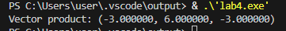
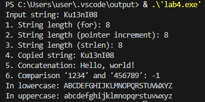
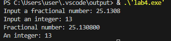
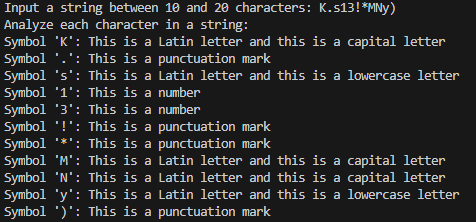

# Чащина Ксения Владимировна ИВТ-1.2

## Тема: Введение в функции. Базовая работа со строками (однобайтовыми).

_ _ _

### **Задание 1.1.**
Создайте две функции, которые вычисляют факториал числа:
- функцию, которая вычисляет факториал, используя цикл;
- функцию, которая вычисляет факториал, используя рекурсивный вызов самой себя.

Продемонстрируйте работу обеих функций.
_ _ _

**Список идентификаторов:**
| Имя | Тип    | Описание                           |
|-----|--------|------------------------------------|
| factorial_iterative   | long long   | Функция для вычисления факториала, используя цикл        |
| factorial_recursive   | long long    | Функция для вычисления факториала рекурсивным способом       |
| n | int  | Параметр функции              |
| result | long long  | Переменная для хранения результата              |
| i | int  | Параметр цикла              |
| num | int  | Переменная для хранения числа              |
| iterative_result | long long  | Результат вычисления              |
| recursive_result | long long  | Результат вычисления              |

**Код программы:**
```c
#include <stdio.h>

long long factorial_iterative(int n) {
  if (n < 0) {
    return 0; 
  }
  if (n == 0) {
    return 1;
  }
  long long result = 1;
  for (int i = 1; i <= n; i++) {
    result *= i;
  }
  return result;
}

long long factorial_recursive(int n) {
  if (n < 0) {
    return 0; 
  }
  if (n == 0) {
    return 1;
  } else {
    return n * factorial_recursive(n - 1);
  }
}

int main() {
  int num;
  printf("Input a number: ");
  scanf("%d", &num);
  long long iterative_result = factorial_iterative(num);
  long long recursive_result = factorial_recursive(num);
  if (iterative_result == 0) {
    printf("Error!\n");
  } else {
    printf("Factorial %d (iteratively) = %lld\n", num, iterative_result);
    printf("Factorial %d (recursively) = %lld\n", num, recursive_result);
  }

  return 0;
}
```

**Результат выполненной работы:**


_ _ _

### **Задание 1.2.**
Объявите указатель на массив типа int и динамически выделите память для 12-ти элементов. Напишите функцию, которая поменяет значения чётных и нечётных ячеек массива.
_ _ _

**Список идентификаторов:**
| Имя | Тип    | Описание                           |
|-----|--------|------------------------------------|
| swap_even_odd   | void   | Функция, которая меняет элементы массива        |
| arr   | int *    | Указатель на массив       |
| size | int  | Размер массива              |
| i | int  | Параметр цикла              |
| temp | int  | Переменная для хранения числа              |

**Код программы:**
```c
#include <stdio.h>
#include <stdlib.h>

void swap_even_odd(int *arr, int size) {
    if (arr == NULL || size <= 0) {
        return; // Проверка на некорректные входные данные
    }
    for (int i = 0; i < size - 1; i += 2) {
        int temp = arr[i];
        arr[i] = arr[i + 1];
        arr[i + 1] = temp;
    }
}

int main() {
    int *arr;
    int size = 12;
    arr = (int *)malloc(size * sizeof(int));
    if (arr == NULL) {
        printf("Error!\n");
        return 1; 
    }
    for (int i = 0; i < size; i++) {
        arr[i] = i + 1;
    }
    printf("Array: ");
    for (int i = 0; i < size; i++) {
        printf("%d ", arr[i]);
    }
    printf("\n");
    swap_even_odd(arr, size);
    printf("New array: ");
    for (int i = 0; i < size; i++) {
        printf("%d ", arr[i]);
    }
    printf("\n");
    free(arr);
    arr = NULL; 

    return 0;
}
```

**Результат выполненной работы:**


_ _ _

### **Задание 1.3.**
Создать две основные функции:
- функцию для динамического выделения памяти под двумерный динамический массив типа double — матрицу;
- функцию для динамического освобождения памяти под двумерный динамический массив типа double — матрицу.

Создать две вспомогательные функции:
- функцию для заполнения матрицы типа double;
- функцию для распечатки этой матрицы на экране.

Продемонстрировать работу всех этих функций в своей программе.
_ _ _

**Список идентификаторов:**
| Имя | Тип    | Описание                           |
|-----|--------|------------------------------------|
| allocate_matrix   | double**   | Функция для выделения памяти        |
| matrix   | double**    | Указатель на двумерный массив       |
| free_matrix | void  | Функция для освобождения памяти              |
| fill_matrix | void  | Функция для заполнения матрицы              |
| i | int  | Параметр цикла              |
| j | int  | Параметр цикла              |
| print_matrix | void  | Функция для вывода матрицы              |
| rows | int  | Количество строк в матрице              |
| cols | int  | Количество столбцов в матрице              |

**Код программы:**
```c
#include <stdio.h>
#include <stdlib.h>

// Функция для динамического выделения памяти под двумерный массив (матрицу) типа double
double** allocate_matrix(int rows, int cols) {
    double** matrix = (double**)malloc(rows * sizeof(double*));
    if (matrix == NULL) {
        printf("Error!\n");
        return NULL;
    }
    for (int i = 0; i < rows; i++) {
        matrix[i] = (double*)malloc(cols * sizeof(double));
        if (matrix[i] == NULL) {
            for (int j = 0; j < i; j++) {
                free(matrix[j]);
            }
            free(matrix);
            return NULL;
        }
    }
    return matrix;
}

// Функция для динамического освобождения памяти под двумерный массив (матрицу) типа double
void free_matrix(double** matrix, int rows) {
    if (matrix == NULL) {
        return; 
    }
    for (int i = 0; i < rows; i++) {
        free(matrix[i]);
    }
    free(matrix);
}

// Функция для заполнения матрицы типа double
void fill_matrix(double** matrix, int rows, int cols) {
    if (matrix == NULL) {
        return;
    }
    for (int i = 0; i < rows; i++) {
        for (int j = 0; j < cols; j++) {
            printf("Element[%d][%d] = ", i, j);
            scanf("%lf", &matrix[i][j]); 
        }
    }
}

// Функция для распечатки матрицы на экране
void print_matrix(double** matrix, int rows, int cols) {
    if (matrix == NULL) {
        printf("The matrix doesn't exist!\n");
        return;
    }
    printf("Matrix:\n");
    for (int i = 0; i < rows; i++) {
        for (int j = 0; j < cols; j++) {
            printf("%8.2f ", matrix[i][j]); 
        }
        printf("\n");
    }
}

int main() {
    int rows = 3;
    int cols = 4;
    double** matrix = allocate_matrix(rows, cols);
    if (matrix == NULL) {
        return 1; 
    }
    fill_matrix(matrix, rows, cols);
    print_matrix(matrix, rows, cols);
    free_matrix(matrix, rows);

    return 0;
} 
```

**Результат выполненной работы:**


_ _ _

### **Задание 1.4.**
Создать функцию, которая вычисляет векторное произведение двух векторов в декартовых координатах, используя указатели на соответствующие массивы
_ _ _

**Математическая модель:**

Векторное произведение:  

$$
\vec{a} \times \vec{b} = 
\begin{vmatrix}
\vec{i} & \vec{j} & \vec{k} \\
a_x & a_y & a_z \\
b_x & b_y & b_z
\end{vmatrix} 
= \vec{i} \cdot (a_y b_z - a_z b_y) - \vec{j} \cdot (a_x b_z - a_z b_x) + \vec{k} \cdot (a_x b_y - a_y b_x)
$$

**Список идентификаторов:**
| Имя | Тип    | Описание                           |
|-----|--------|------------------------------------|
| vector_product   | void   | Функция для вычисления векторного произведения        |
| v1, v2   | double *    | Указатель на вектора       |
| result | double *  | Указатель на массив с решением              |

**Код программы:**
```c
#include <stdio.h>

void vector_product(double *v1, double *v2, double *result) {
    result[0] = v1[1] * v2[2] - v1[2] * v2[1]; 
    result[1] = v1[2] * v2[0] - v1[0] * v2[2]; 
    result[2] = v1[0] * v2[1] - v1[1] * v2[0]; 
}

int main() {
    double vector1[3] = {1.0, 2.0, 3.0};
    double vector2[3] = {4.0, 5.0, 6.0};
    double result_vector[3];
    vector_product(vector1, vector2, result_vector);
    printf("Vector product: (%lf, %lf, %lf)\n", result_vector[0], result_vector[1], result_vector[2]);

    return 0;
}
```

**Результат выполненной работы:**


_ _ _

### **Задание 2.1.**
Создайте новую программу, где с клавиатуры вводится строка некоторой длины порядка 10 латинских символов (не используйте кириллицу) в классическую строку языка C, которая имеет вид массива char my_string[MY_SIZE]. MY_SIZE определите с помощью директивы #define. Значение MY_SIZE должно превышать длину вводимой строки с некоторым разумным запасом. Другие строки в этой задаче можете создавать либо также как статические массивы, либо как динамические массивы, но не забывайте освобождать от динамически выделенную память с помощью функции void free(void* ptr).

Выполните следующие действия и распечатайте результаты:
1. Вычислите длину строки my_string, используя цикл for и тот факт, что в языке C такие строки имеют в конце специальный нулевой символ конца строки, представленный escape-последовательностью '\0'.
2. Сделайте тоже самое, что в пункте 1, но создайте указатель на начало вашей строки и используйте операцию инкремента ++.
3. Используйте функции size_t strlen(const char* str); или size_t strnlen(const char* string, size_t maxlen); или size_t strnlen_s(const char* str, size_t strsz); для получения размера строки в виде значения size_t (псевдоним unsigned int, спецификатор форматирования — "%zu").
4. Создайте вторую строку (второй массив) и скопируйте в неё строку my_string, используя функцию char* strcpy(char* dest, const char* src); или char* strncpy(char* dest, const char* src, size_t n);.
5. Создайте ещё две строки какого-либо размера и задайте их прямо в коде без клавиатуры. Сделайте конкатенацию этих двух строк, используя char* strcat(char* dest, const char* src); или char* strncat(char* dest, const char* src, size_t n);. Первая строка трактуется как dest (destination), и подберите размер этого массива с запасом.
6. Сравните две новые строки, заданные в коде строковыми литералами, используя функцию int strcmp(const char* lhs, const char* rhs); или int strncmp(const char* s1, const char* s2, size_t n);.
7. Задайте прямо в коде строку, в которой есть только латинские символы в верхнем и нижнем регистре. Переведите строку полностью в нижний регистр и отдельно полностью в верхний регистр. Распечатайте каждый результат отдельно. Найдите сигнатуры подходящих функций (tolower и toupper).
_ _ _

**Список идентификаторов:**
| Имя | Тип    | Описание                           |
|-----|--------|------------------------------------|
| MY_SIZE   | #define   |Размер массива строк        |
| my_string   | char    | Введанная строка       |
| copied_string   | char    | Массив для хранения копии строки       |
| string1, string2   | char[20]    | Массивы для хранения строк для конкатенации      |
| len   | size_t    | Переменная для хранения длины строки       |
| string_length | int  | Длина строки, вычесленная циклом             |
| i | int  | Параметр цикла              |
| ptr | char *  | Указатель на символ для вычисления длины строки              |
| length_with_pointer | int  | Длина строки, вычесленная инкрементом            |
| cmp_result | int  | Результат сравнения строк              |
| case_string, case_string2 | char[]  | Масси для хранения преобразованной строки              |

**Код программы:**
```c
#include <stdio.h>
#include <string.h>
#include <locale.h>
#include <ctype.h>

#define MY_SIZE 50

int main() {
    char my_string[MY_SIZE];
    char copied_string[MY_SIZE];
    char string1[20] = "Hello, ";
    char string2[20] = "world!";

    setlocale(LC_ALL, "en_US.iso88591");

    // Ввод строки
    printf("Input string: ");
    fgets(my_string, MY_SIZE, stdin);

    // Удаляем символ новой строки
    size_t len = strlen(my_string);
    if (len > 0 && my_string[len - 1] == '\n') {
        my_string[len - 1] = '\0';
    }

    // Длина строки 
    int string_length = 0;
    for (int i = 0; my_string[i] != '\0'; i++) {
        string_length++;
    }
    printf("1. String length (for): %d\n", string_length);

    // Длина строки (strlen c инкрементом указателя)
    char *ptr = my_string; 
    int length_with_pointer = 0;
    while (*ptr != '\0')
    {
      length_with_pointer++;
      ptr++; 
    }
    printf("2. String length (pointer increment): %d\n", length_with_pointer);

    // Длина строки (strlen)
    printf("3. String length (strlen): %zu\n", strlen(my_string));

    // Копирование строки
    strcpy(copied_string, my_string);
    printf("4. Copied string: %s\n", copied_string);

    // Конкатенация строк
    strcat(string1, string2);
    printf("5. Concatenation: %s\n", string1);

    // Сравнение строк
    char string3[] = "1234";
    char string4[] = "456789";
    int cmp_result = strcmp(string3, string4);
    printf("6. Comparison '%s' and '%s': %d\n", string3, string4, cmp_result);

    // Преобразование регистра
    char case_string[] = "aBcDeFgHiJkLmNoPqRsTuVwXyZ"; 
    // Преобразование в верхний регистр
    for (int i = 0; case_string[i] != '\0'; i++) {
        case_string[i] = toupper(case_string[i]);
    }
    printf("In lowercase: %s\n", case_string);
    char case_string2[] = "aBcDeFgHiJkLmNoPqRsTuVwXyZ";
    // Преобразование в нижний регистр
    for (int i = 0; case_string2[i] != '\0'; i++) {
        case_string2[i] = tolower(case_string2[i]);
    }
    printf("In uppercase: %s\n", case_string2);

    return 0;
}
```

**Результат выполненной работы:**


_ _ _

### **Задание 2.2.**
Конвертируйте введённые заданные как строки: число с плавающей точкой (double) и целое число (int) в значения типаdouble и int, используя функциями atof и atoi
_ _ _

**Список идентификаторов:**
| Имя | Тип    | Описание                           |
|-----|--------|------------------------------------|
| double_str   | char[20]   | Строка для ввода числа с плавающей точкой        |
| int_str   | char[20]   | Строка для ввода целого числа        |
| double_num   | double    | преобразованное число с плавающей точкой      |
| int_num | int  | Преобразованное целое число              |

**Код программы:**
```c
#include <stdio.h>
#include <stdlib.h>

int main() {
    char double_str[20];
    char int_str[20];
    double double_num;
    int int_num;
    printf("Input a fractional number: ");
    fgets(double_str, sizeof(double_str), stdin);
    printf("Input an integer: ");
    fgets(int_str, sizeof(int_str), stdin);
    double_num = atof(double_str);
    int_num = atoi(int_str);
    printf("Fractional number: %lf\n", double_num);
    printf("An integer: %d\n", int_num);

    return 0;
}
```

**Результат выполненной работы:**


_ _ _

### **Задание 2.3.**
Создайте строку от 10 до 20 символов, используя только цифры, латинский буквы в разных регистрах пробельные символы и символы пунктуации. Организуйте цикл, где каждый символ подробно тестируется функциями типа int is∗(/∗... ∗/) (например — isdigit, ispunct).
_ _ _

**Список идентификаторов:**
| Имя | Тип    | Описание                           |
|-----|--------|------------------------------------|
| input_string   | char[21]   | Вводимая строка        |
| i | int    | Параметр цикла       |
| isdigit | int    | Функция, проверяющая, является ли символ цифрой        |
| isalpha | int    | Функция, проверяющая, является ли символ буквой       |
| islower | int    | Функция, проверяющая, является ли символ строчной буквой       |
| isspace | int    | Функция, проверяющая, является ли символ пробельным символом       |
| ispunct | int    | Функция, проверяющая, является ли символ знаком пунктуации       |

**Код программы:**
```c
#include <stdio.h>
#include <string.h>
#include <ctype.h>

int main() {
    char input_string[21]; 
    int i;

    printf("Input a string between 10 and 20 characters: ");
    fgets(input_string, sizeof(input_string), stdin);
    printf("Analyze each character in a string:\n");
    for (i = 0; input_string[i] != '\0'; i++) {
        printf("Symbol '%c': ", input_string[i]);

        if (isdigit(input_string[i])) {
            printf("This is a number ");
        } else if (isalpha(input_string[i])) {
            printf("This is a Latin letter ");
            if (islower(input_string[i])) {
                printf("and this is a lowercase letter ");
            } else {
                printf("and this is a capital letter ");
            }
        } else if (isspace(input_string[i])) {
            printf("This is a whitespace character ");
        } else if (ispunct(input_string[i])) {
            printf("This is a punctuation mark ");
        } else {
            printf("This is a different symbol ");
        }
        printf("\n");
    }

    return 0;
}
```

**Результат выполненной работы:**

