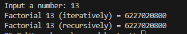
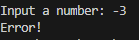
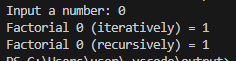
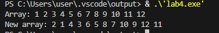
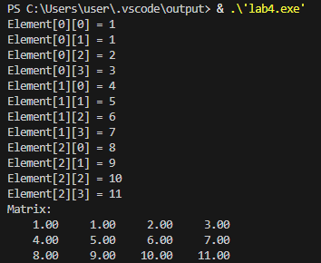

# Чащина Ксения Владимировна ИВТ-1.2

## Тема: Введение в функции. Базовая работа со строками (однобайтовыми).

_ _ _

### **Задание 1.1.**
Создайте две функции, которые вычисляют факториал числа:
- функцию, которая вычисляет факториал, используя цикл;
- функцию, которая вычисляет факториал, используя рекурсивный вызов самой себя.

Продемонстрируйте работу обеих функций.
_ _ _

**Список идентификаторов:**
| Имя | Тип    | Описание                           |
|-----|--------|------------------------------------|
| factorial_iterative   | long long   | Функция для вычисления факториала, используя цикл        |
| factorial_recursive   | long long    | Функция для вычисления факториала рекурсивным способом       |
| n | int  | Параметр функции              |
| result | long long  | Переменная для хранения результата              |
| i | int  | Параметр цикла              |
| num | int  | Переменная для хранения числа              |
| iterative_result | long long  | Результат вычисления              |
| recursive_result | long long  | Результат вычисления              |

**Код программы:**
```c
#include <stdio.h>

long long factorial_iterative(int n) {
  if (n < 0) {
    return 0; 
  }
  if (n == 0) {
    return 1;
  }
  long long result = 1;
  for (int i = 1; i <= n; i++) {
    result *= i;
  }
  return result;
}

long long factorial_recursive(int n) {
  if (n < 0) {
    return 0; 
  }
  if (n == 0) {
    return 1;
  } else {
    return n * factorial_recursive(n - 1);
  }
}

int main() {
  int num;
  printf("Input a number: ");
  scanf("%d", &num);
  long long iterative_result = factorial_iterative(num);
  long long recursive_result = factorial_recursive(num);
  if (iterative_result == 0) {
    printf("Error!\n");
  } else {
    printf("Factorial %d (iteratively) = %lld\n", num, iterative_result);
    printf("Factorial %d (recursively) = %lld\n", num, recursive_result);
  }

  return 0;
}
```

**Результат выполненной работы:**




_ _ _

### **Задание 1.2.**
Объявите указатель на массив типа int и динамически выделите память для 12-ти элементов. Напишите функцию, которая поменяет значения чётных и нечётных ячеек массива.
_ _ _

**Список идентификаторов:**
| Имя | Тип    | Описание                           |
|-----|--------|------------------------------------|
| swap_even_odd   | void   | Функция, которая меняет элементы массива        |
| arr   | int *    | Указатель на массив       |
| size | int  | Размер массива              |
| i | int  | Параметр цикла              |
| temp | int  | Переменная для хранения числа              |

**Код программы:**
```c
#include <stdio.h>
#include <stdlib.h>

void swap_even_odd(int *arr, int size) {
    if (arr == NULL || size <= 0) {
        return; // Проверка на некорректные входные данные
    }
    for (int i = 0; i < size - 1; i += 2) {
        int temp = arr[i];
        arr[i] = arr[i + 1];
        arr[i + 1] = temp;
    }
}

int main() {
    int *arr;
    int size = 12;
    arr = (int *)malloc(size * sizeof(int));
    if (arr == NULL) {
        printf("Error!\n");
        return 1; 
    }
    for (int i = 0; i < size; i++) {
        arr[i] = i + 1;
    }
    printf("Array: ");
    for (int i = 0; i < size; i++) {
        printf("%d ", arr[i]);
    }
    printf("\n");
    swap_even_odd(arr, size);
    printf("New array: ");
    for (int i = 0; i < size; i++) {
        printf("%d ", arr[i]);
    }
    printf("\n");
    free(arr);
    arr = NULL; 

    return 0;
}
```

**Результат выполненной работы:**


_ _ _

### **Задание 1.3.**
Создать две основные функции:
- функцию для динамического выделения памяти под двумерный динамический массив типа double — матрицу;
- функцию для динамического освобождения памяти под двумерный динамический массив типа double — матрицу.

Создать две вспомогательные функции:
- функцию для заполнения матрицы типа double;
- функцию для распечатки этой матрицы на экране.

Продемонстрировать работу всех этих функций в своей программе.
_ _ _

**Список идентификаторов:**
| Имя | Тип    | Описание                           |
|-----|--------|------------------------------------|
| allocate_matrix   | double**   | Функция для выделения памяти        |
| matrix   | double**    | Указатель на двумерный массив       |
| free_matrix | void  | Функция для освобождения памяти              |
| fill_matrix | void  | Функция для заполнения матрицы              |
| i | int  | Параметр цикла              |
| j | int  | Параметр цикла              |
| print_matrix | void  | Функция для вывода матрицы              |
| rows | int  | Количество строк в матрице              |
| cols | int  | Количество столбцов в матрице              |

**Код программы:**
```c
#include <stdio.h>
#include <stdlib.h>

// Функция для динамического выделения памяти под двумерный массив (матрицу) типа double
double** allocate_matrix(int rows, int cols) {
    double** matrix = (double**)malloc(rows * sizeof(double*));
    if (matrix == NULL) {
        printf("Error!\n");
        return NULL;
    }
    for (int i = 0; i < rows; i++) {
        matrix[i] = (double*)malloc(cols * sizeof(double));
        if (matrix[i] == NULL) {
            for (int j = 0; j < i; j++) {
                free(matrix[j]);
            }
            free(matrix);
            return NULL;
        }
    }
    return matrix;
}

// Функция для динамического освобождения памяти под двумерный массив (матрицу) типа double
void free_matrix(double** matrix, int rows) {
    if (matrix == NULL) {
        return; 
    }
    for (int i = 0; i < rows; i++) {
        free(matrix[i]);
    }
    free(matrix);
}

// Функция для заполнения матрицы типа double
void fill_matrix(double** matrix, int rows, int cols) {
    if (matrix == NULL) {
        return;
    }
    for (int i = 0; i < rows; i++) {
        for (int j = 0; j < cols; j++) {
            printf("Element[%d][%d] = ", i, j);
            scanf("%lf", &matrix[i][j]); 
        }
    }
}

// Функция для распечатки матрицы на экране
void print_matrix(double** matrix, int rows, int cols) {
    if (matrix == NULL) {
        printf("The matrix doesn't exist!\n");
        return;
    }
    printf("Matrix:\n");
    for (int i = 0; i < rows; i++) {
        for (int j = 0; j < cols; j++) {
            printf("%8.2f ", matrix[i][j]); 
        }
        printf("\n");
    }
}

int main() {
    int rows = 3;
    int cols = 4;
    double** matrix = allocate_matrix(rows, cols);
    if (matrix == NULL) {
        return 1; 
    }
    fill_matrix(matrix, rows, cols);
    print_matrix(matrix, rows, cols);
    free_matrix(matrix, rows);

    return 0;
} 
```

**Результат выполненной работы:**

