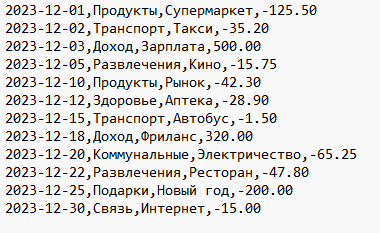
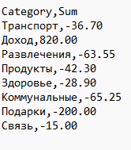

# Чащина Ксения Владимировна ИВТ-1.2

## Проект: Анализ транзакций.

_ _ _

### **Описание**
Программа анализирует ваши финансовые транзакции, группирует их по категориям и генерирует понятный отчёт.

### **Структура проекта**
expense_tracker

├── finance.h

├── finance.c  

├── main.c  

├── Makefile

└── transactions.csv
_ _ _

**Список идентификаторов:**
| Имя | Тип    | Описание                           |
|-----|--------|------------------------------------|
| Transaction   | struct   | Структура, представляющая финансовую транзакцию        |
| date   | char[11]    | Экземпляр структуры Transaction для хранения даты транзакции       |
| category | char[MAX_CATEGORY]   | Экземпляр структур Transaction и CategoryTotal для хранения категории транзакции              |
| description | char[MAX_DESC]  | Экземпляр структуры Transaction для хранения описания транзакции              |
| amount | double  | Сумма транзакции              |
| CategoryTotal | struct  | Структура, хранящая общую сумму для определенной категории           |
| total | double  | Общая сумма для категории              |
| load_data | int  | Загружает данные о транзакциях из файла              |
| process_data | void  | Обрабатывает данные о транзакциях для расчета общей суммы по категориям              |
| save_report | void  | Сохраняет отчет об общей сумме по категориям в файл              |
| filename | const char*  | Параметр имени файла              |
| data | Transaction*  | Указатель на данные о транзакциях              |
| max | int  | Максимальное количество записей для загрузки              |
| count | int  | Количество транзакций              |
| result | CategoryTotal*  | Указатель на результаты общей суммы по категориям              |
| result_count | int*  | Указатель на количество результирующих записей              |

**Код программы:**

#### finance.h (заголовочный файл)

```c
#ifndef FINANCE_H
#define FINANCE_H

#define MAX_CATEGORY 30
#define MAX_DESC 100
#define MAX_ENTRIES 500

typedef struct {
    char date[11];
    char category[MAX_CATEGORY];
    char description[MAX_DESC];
    double amount;
} Transaction;

typedef struct {
    char category[MAX_CATEGORY];
    double total;
} CategoryTotal;

int load_data(const char* filename, Transaction* data, int max);
void process_data(Transaction* data, int count, CategoryTotal* result, int* result_count);
void save_report(const char* filename, CategoryTotal* result, int count);

#endif
```

#### finance.c (реализация)

```c
#include "finance.h"
#include <stdio.h>
#include <string.h>

int load_data(const char* filename, Transaction* data, int max) {
    FILE* file = fopen(filename, "r");
    if (!file) return -1;

    char header[256];
    fgets(header, sizeof(header), file);

    int count = 0;
    while (count < max && fscanf(file, "%10[^,],%29[^,],%99[^,],%lf\n",
           data[count].date,
           data[count].category,
           data[count].description,
           &data[count].amount) == 4) {
        count++;
    }
    fclose(file);
    return count;
}

void process_data(Transaction* data, int count, CategoryTotal* result, int* result_count) {
    *result_count = 0;
    
    for (int i = 0; i < count; i++) {
        int found = 0;
        
        for (int j = 0; j < *result_count; j++) {
            if (strcmp(data[i].category, result[j].category) == 0) {
                result[j].total += data[i].amount;
                found = 1;
                break;
            }
        }
        
        if (!found) {
            strcpy(result[*result_count].category, data[i].category);
            result[*result_count].total = data[i].amount;
            (*result_count)++;
        }
    }
}

void save_report(const char* filename, CategoryTotal* result, int count) {
    FILE* file = fopen(filename, "w");
    if (!file) return;

    fprintf(file, "Category,Sum\n");
    for (int i = 0; i < count; i++) {
        fprintf(file, "%s,%.2f\n", result[i].category, result[i].total);
    }
    fclose(file);
}
```

#### main.c (основная программа)

```c
#include "finance.h"
#include <stdio.h>

int main(int argc, char* argv[]) {
    if (argc < 3) {
        printf("Usage: %s <transactions.csv> <report.csv>\n", argv[0]);
        return 1;
    }

    Transaction records[MAX_ENTRIES];
    CategoryTotal totals[MAX_ENTRIES];
    int record_count, total_count;

    record_count = load_data(argv[1], records, MAX_ENTRIES);
    if (record_count <= 0) {
        printf("Error loading data\n");
        return 1;
    }

    process_data(records, record_count, totals, &total_count);
    save_report(argv[2], totals, total_count);

    printf("The report is ready. %d transactions processed\n", record_count);
    return 0;
}
```

#### Makefile (сборка)

```c
CC = gcc
CFLAGS = -Wall -Wextra -std=c11
TARGET = finance

all: $(TARGET)

$(TARGET): main.o finance.o
 $(CC) $(CFLAGS) $^ -o $@

%.o: %.c
 $(CC) $(CFLAGS) -c $<

clean:
 rm -f *.o $(TARGET)
```

**Результат выполненной работы:**

#### Исходный файл (transactions.csv)


#### Результирующий файл (report.csv)

