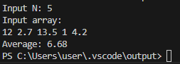
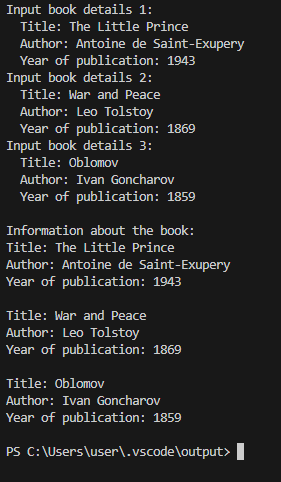
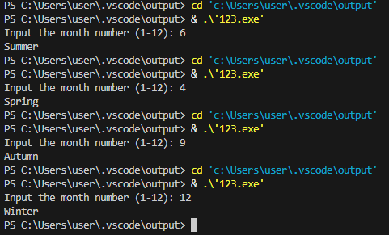

# Чащина Ксения Владимировна ИВТ-1.2
_ _ _

### **Задание 1.** Динамический массив и вычисление среднего арифметического
Напишите программу на языке Си, которая:
- Запрашивает у пользователя количество элементов массива (целое число N).
- Динамически выделяет память для массива из N элементов типа float.
- Заполняет массив значениями, введёнными с клавиатуры.
- Вычисляет и выводит среднее арифметическое всех элементов массива.
- При обращении к элементам массива используйте арифметику указателей (без оператора []).

_ _ _

**Математическая модель:**

$$
average = sum / N
$$

**Список идентификаторов:**
| Имя | Тип    | Описание                           |
|-----|--------|------------------------------------|
|  N  | int    | Количество элементов в массиве        |
| arr   | float*    | Указатель на динамически выделенный массив чисел        |
| sum | float    | Сумма элементов               |
| average | float    | Среднее арифметическое               |
| i | int    | Параметр цикла               |


**Код программы:**
```c
#include <stdio.h>
#include <stdlib.h>

int main() {
    int N;
    float *arr;
    float sum = 0;
    int i;
    printf("Input N: ");
    scanf("%d", &N);
    arr = (float*)malloc(N * sizeof(float));
    if (arr == NULL) {
        printf("Memory allocation error!\n");
        return 1;
    }
    printf("Input array:\n");
    for (i = 0; i < N; i++) {
        scanf("%f", arr + i);
        sum += *(arr + i);
    }
    float average = sum / N;
    printf("Average: %.2f\n", average);
    free(arr);
    return 0;
}
```

**Результат выполненной работы:**


_ _ _

### **Задание 2.** Каталог книг
Создайте структуру Book, которая содержит следующие поля:
- title – массив символов (строка) для хранения названия книги (максимум 50 символов);
- author – массив символов для хранения имени автора (максимум 50 символов);
- year – целое число, обозначающее год издания книги.

Напишите программу, которая:
- Создаёт массив из 3-х экземпляров структуры Book.
- Запрашивает у пользователя данные для каждой книги (название, автора и год издания).
- Выводит информацию обо всех книгах на экран, используя для этого отдельную функцию printBook(), которая принимает указатель на структуру Book

_ _ _

**Список идентификаторов:**
| Имя | Тип    | Описание                           |
|-----|--------|------------------------------------|
| max_length   | #define    | Максимальная длина строки        |
| Book   | sruct    | Структура для хранения информации        |
| title | char    | Поле структуры, название книги             |
| author | char    | Поле структуры, имя автора               |
| year | int    | Поле структуры, год издания               |
| printBook | void    | функция для вывода информации         |
| i | int    | Параметр цикла                        |
| books | struct Book[3]    | Массив экземпляров структуры               |

**Код программы:**
```c
#include <stdio.h>
#include <string.h>
#define max_length 50 

typedef struct {
    char title[max_length];
    char author[max_length];
    int year;
} Book;
void printBook(const Book *book) {
    printf("Title: %s", book->title);
    printf("Author: %s", book->author);
    printf("Year of publication: %d\n", book->year);
}
int main() {
    Book books[3]; 
    for (int i = 0; i < 3; i++) {
        printf("Input book details %d:\n", i + 1);
        printf("  Title: ");
        fgets(books[i].title, max_length, stdin); 
        printf("  Author: ");
        fgets(books[i].author, max_length, stdin); 
        printf("  Year of publication: ");
        scanf("%d", &books[i].year);
        getchar(); 
    }
    printf("\nInformation about the book:\n");
    for (int i = 0; i < 3; i++) {
        printBook(&books[i]);
        printf("\n");
    }
    return 0;
}
```

**Результат выполненной работы:**


_ _ _

### **Задание 3.** Определение сезона по номеру месяца
Создайте перечисление Season со следующими значениями:
- WINTER, SPRING, SUMMER, AUTUMN
Напишите программу, которая:
- Запрашивает у пользователя номер месяца (целое число от 1 до 12).
- На основе введённого номера месяца определяет и выводит соответствующий сезон:
  - Зима: декабрь (12), январь (1) и февраль (2);
  - Весна: март (3), апрель (4) и май (5);
  - Лето: июнь (6), июль (7) и август (8);
  - Осень: сентябрь (9), октябрь (10) и ноябрь (11).
- Для определения сезона можно использовать условные операторы (if-else) или конструкцию switch.
_ _ _

**Список идентификаторов:**
| Имя | Тип    | Описание                           |
|-----|--------|------------------------------------|
| a   | float    | Вводимое число с клавиатуры        |
| b   | float    | Вводимое число с клавиатуры        |
| sum | float    | Результат вычисления               |

**Код программы:**
```c

```

**Результат выполненной работы:**

